# **Integración de Zorin OS en un dominio Active Directory (Windows Server 2022)**

***

# **1. Introducción**

En esta práctica se ha llevado a cabo la integración de un equipo con sistema operativo Linux (Zorin OS) dentro de un dominio Active Directory configurado en un servidor Windows Server 2022.

El objetivo es conseguir que el sistema Linux pueda autenticarse mediante usuarios del dominio, gestionar permisos y acceder a recursos compartidos, simulando un entorno de red real en el que conviven sistemas Windows y Linux.

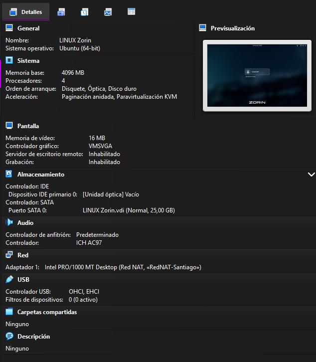 

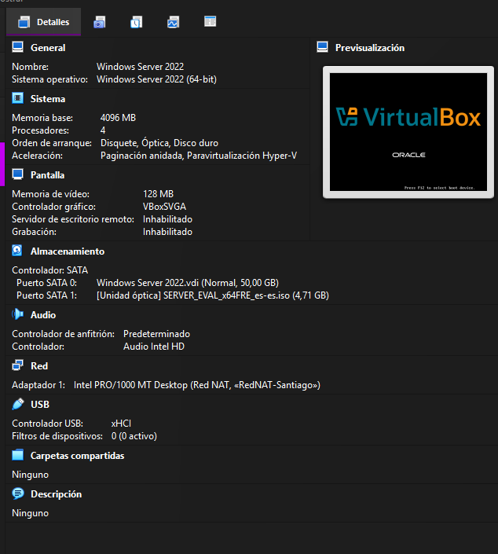 

***

# **2. Configuración del servidor**

## **2.1 Configuración de red**

Se ha configurado el servidor con una dirección IP fija:

*   IP: 10.0.2.6
*   Máscara: 255.255.255.0
*   Puerta de enlace: 10.0.2.1
*   DNS: 10.0.2.6

El servidor DNS apunta a sí mismo, ya que es el encargado de gestionar el dominio.

***

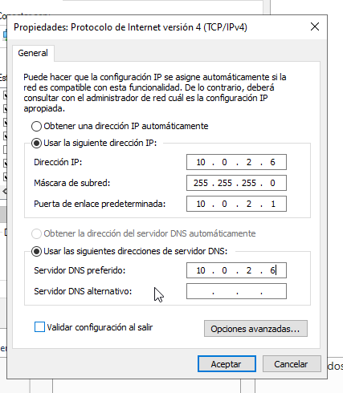 

*   IP
*   DNS
*   configuración manual

***

## **2.2 Verificación del DNS**

Se comprueba la resolución del dominio:

```
resolvectl status
nslookup foodlogic10.test
```

El dominio debe resolverse correctamente hacia la IP del servidor.

***

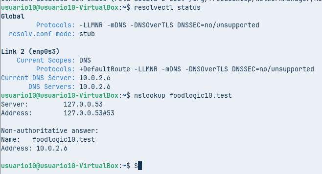 


***

# **3. Configuración del cliente Zorin OS**

## **3.1 Instalación de paquetes**

Se instalan las herramientas necesarias:

```
sudo apt update
sudo apt install realmd sssd sssd-tools libnss-sss libpam-sss adcli samba-common-bin oddjob oddjob-mkhomedir packagekit -y
```

***

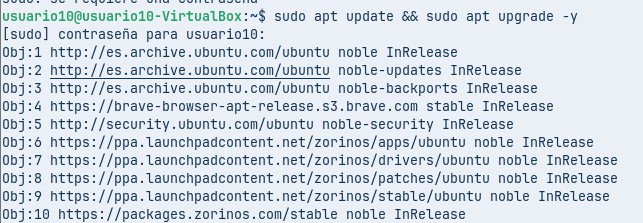 

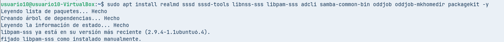 

***

## **3.2 Descubrimiento del dominio**

```
realm discover foodlogic10.test
```

Se comprueba que el dominio es accesible.

***

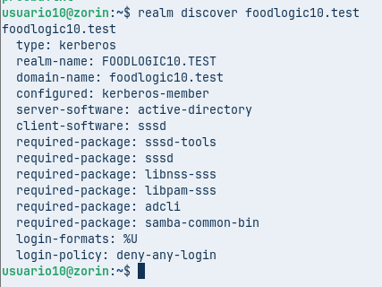 

***

# **4. Problemas encontrados y resolución**

Durante el proceso se presentaron varios problemas.

*   Fallo en la unión al dominio → solucionado revisando DNS y hora
*   Error de autenticación → uso correcto del usuario “Administrador”
*   Hostname incorrecto → corregido manualmente
*   Problemas de permisos → solucionado configurando sudoers

Este proceso permitió comprender la relación entre DNS, Kerberos y autenticación en red.

***

# **5. Unión al dominio**

## **5.1 Unión y verificacion**

```
sudo realm join foodlogic10.test -U Administrador
```
```
realm list
```

***

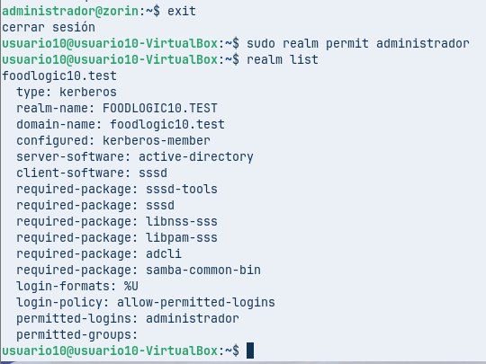 

***

# **6. Inicio de sesión con usuario del dominio y verificacion **

```
su - Administrador@foodlogic10.test
```

```
id administrador
```

***

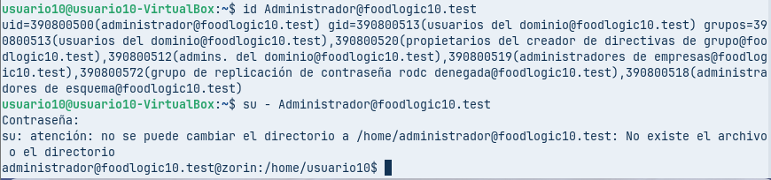 

***

# **7. Creación automática de carpeta personal**

Se habilita:

```
sudo pam-auth-update
```

Se activa:

    Create home directory on login

***

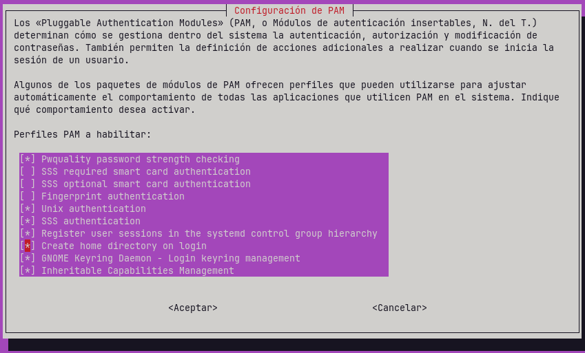 

***

## **Verificación**

```
su - administrador
pwd
```

Debe mostrar:

    /home/administrador

***

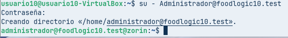 

***

# **8. Acceso a carpeta compartida**

## **8.1 Configuración en el servidor**

Se crea la carpeta:

    C:\Compartido

Se configuran permisos:

*   compartición → Usuarios del dominio (lectura y escritura)
*   seguridad (NTFS) → Usuarios del dominio (control total)

***

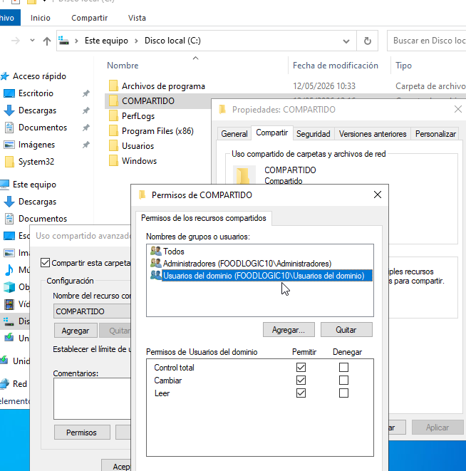 

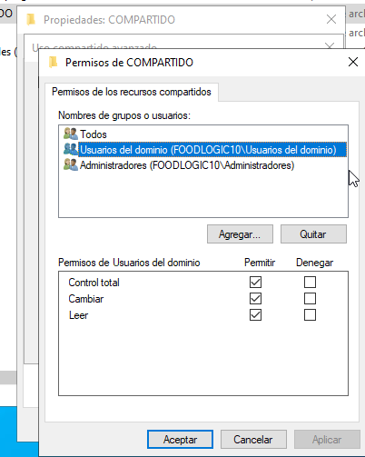 


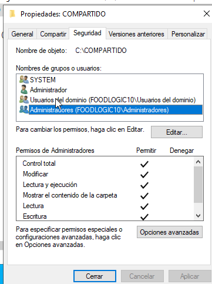 


***

## **8.2 Acceso desde el cliente**

Se monta la carpeta:

```
sudo mount -t cifs //10.0.2.6/Compartido /mnt/compartido -o user=administrador,uid=1000,gid=1000,file_mode=0777,dir_mode=0777
```

Se utilizan parámetros para permitir escritura desde el usuario local.

***

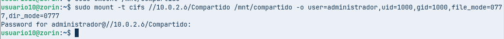 

***

## **8.3 Prueba de escritura**

```
touch /mnt/compartido/prueba.txt
ls /mnt/compartido
```

***

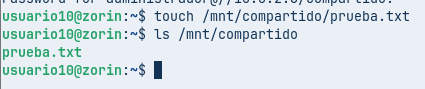 


***

## **8.5 Validación en Windows**

Se comprueba en:

    C:\Compartido

***

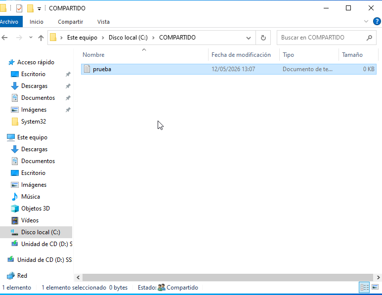 


***

# **9. Configuración de permisos administrativos**

Se edita:

```
sudo visudo
```

Añadiendo:

    administrador ALL=(ALL) ALL

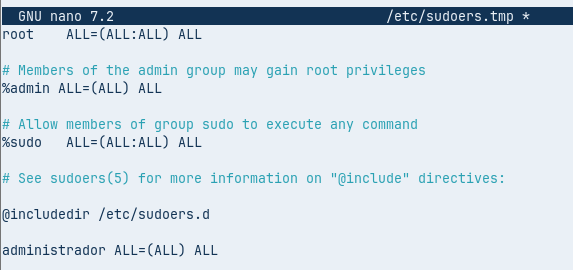 

***

## **Verificación**

```
sudo whoami
```

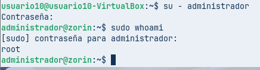 


***

# **10. Control de acceso**

Se limita el acceso:

```
sudo realm permit administrador
sudo realm deny --all
```

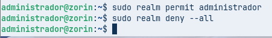 

***

## **Verificación**

```
realm list
```

***

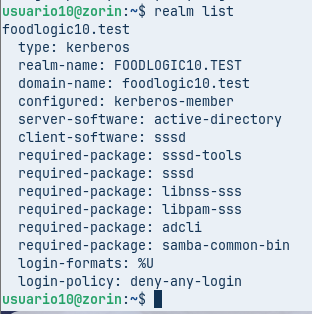 

***

# **11. Conclusión**

Se ha conseguido integrar correctamente un sistema Linux dentro de un dominio Active Directory, permitiendo la autenticación centralizada, el acceso a recursos compartidos y la gestión de permisos.

El entorno configurado refleja una estructura funcional en la que diferentes sistemas operativos trabajan de forma conjunta, manteniendo control y seguridad desde el servidor.

***

# **Notas finales**

*   El DNS es el elemento más crítico de toda la configuración
*   Kerberos requiere sincronización horaria exacta
*   Los permisos en Windows deben configurarse tanto en compartición como en NTFS
*   El uso de CIFS permite la comunicación entre Linux y Windows

